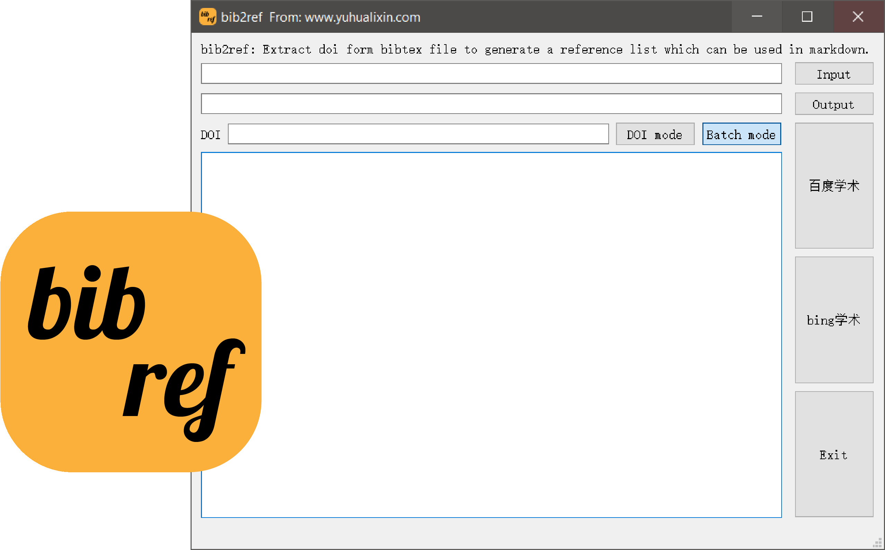
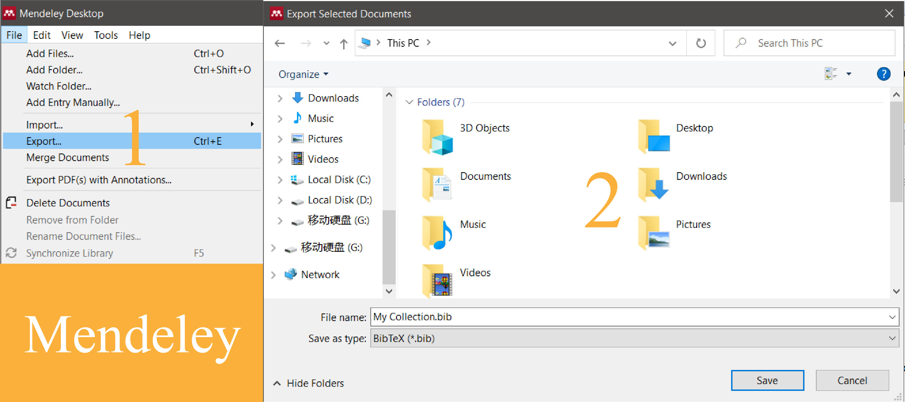
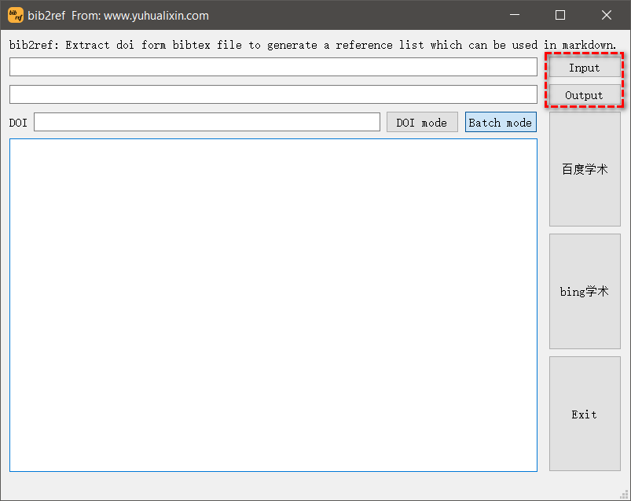
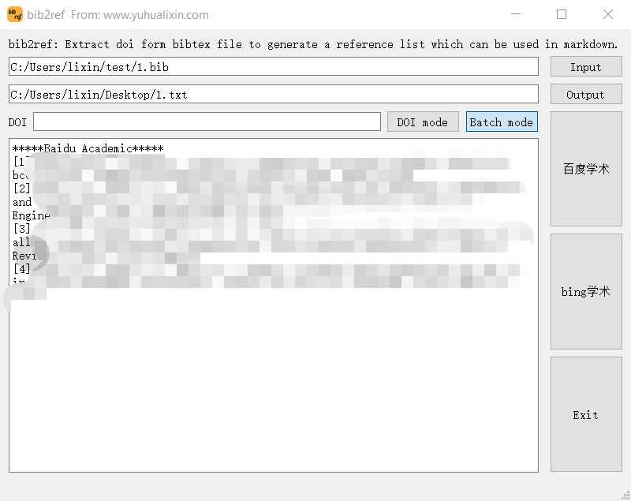
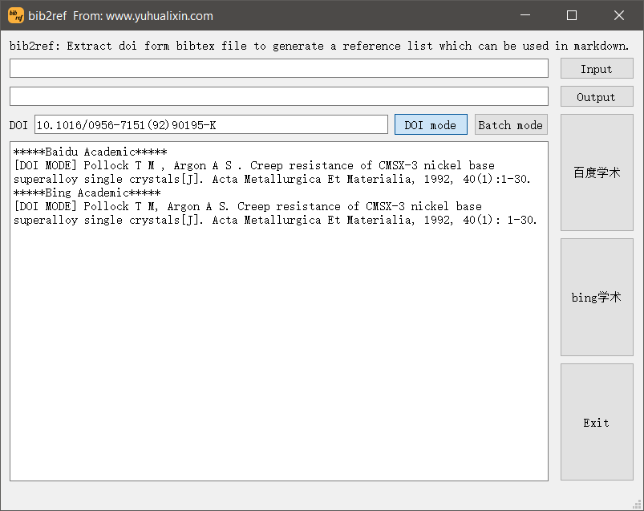

# bib2ref
a script to extract doi form bibtex file to generate a reference list which can be used in markdown

bib2ref: 一个用来从bibtex文件中提取doi号并生成markdown可使用的参考文献列表的脚本

There is a need to generate a reference list form Mendeley which can be used in markdown software such as typora. However, there is no convenient tool to finish this work, and we build a python3 script to generate it. If you want to use this script, Anaconda3 is recommended for you, and selenium module is needed to install on your PC. 

```powershell
conda install selenium
```

Moreover, Chrome headless is also needed, you must install a chromedriver matching with your Chrome version. Here is a path you can download from it:

```html
http://npm.taobao.org/mirrors/chromedriver/
```
---

### **bib2ref : a GUI version has been released** 

bib2ref:  GUI版本已经发布

There is a need to generate a reference list form bibtex which can be used in markdown software such as typora. However, there is no convenient tool to finish this work, and we build a little program to generate it.



---

**Download a GUI version of bib2ref:** 

Download:https://www.yuhualixin.com/cloud/index.php?share/file&user=1&sid=ebYpfwdi  PWD:QfX1L

You can also get this software and source code in my github: https://github.com/lixin555/bib2ref

The site of a old version script of bib2ref: https://www.yuhualixin.com/714.html

---

This executable program of GUI version is based on pyqt5. If you want to use this software, chromedriver must be installed and variable of environment should be configured on your PC. 

**Download chromedriver**: https://npm.taobao.org/mirrors/chromedriver/

### **New Feature:**

1.support to query reference list via Bing academic server

2.doi mode is provided to query single doi and get its reference

3.add a graphical user interface and this software can be used conveniently

### **Tutorial:**

**a.Batch Mode (Default mode)**

1.default mode is the batch mode which asks you to get bibtex file (.bib) from Mendeley, Web Of Science, Elsevier, CNKI ...

2.open bib2ref and click "input" button to select your bibtex file. Click "output" button to create a txt file to save data.



3.click "百度学术" or "bing学术" to generate reference list which can be got in the textbox below or  your output txt file.



**b.DOI Mode** 

A single doi number can be queried by this mode. You need click "DOI mode" button to switch this mode. Then click "百度学术" or "bing学术" to get reference in the textbox below.



**Error Information:**

```
Timeout or There is no data matching with this doi
```

If you meet this error, it means that there is no data matching with your doi or your internet speed is too slow.
